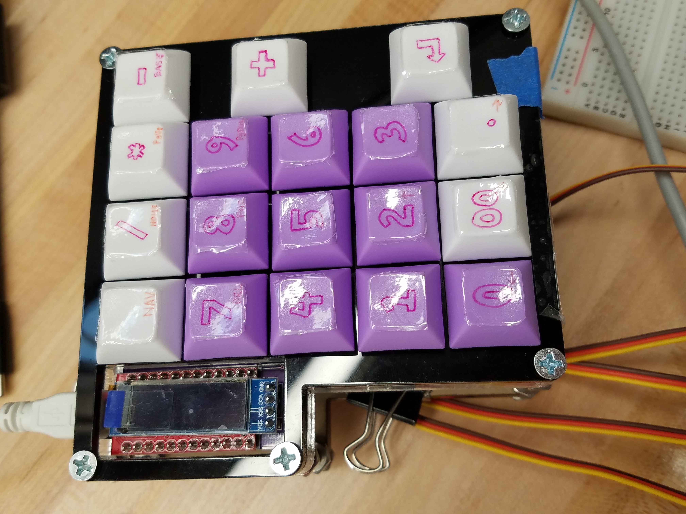
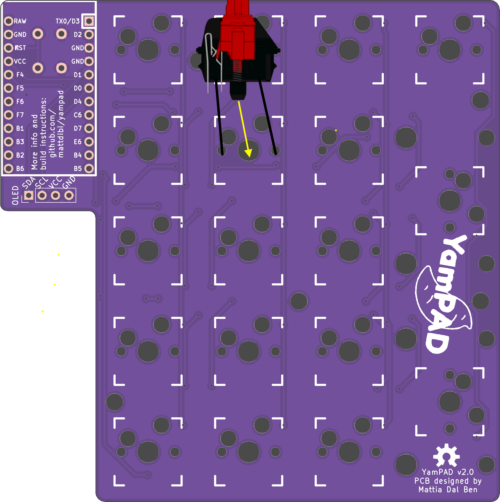
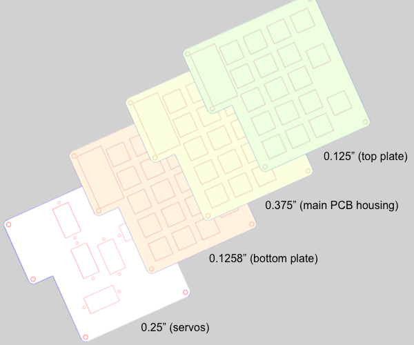
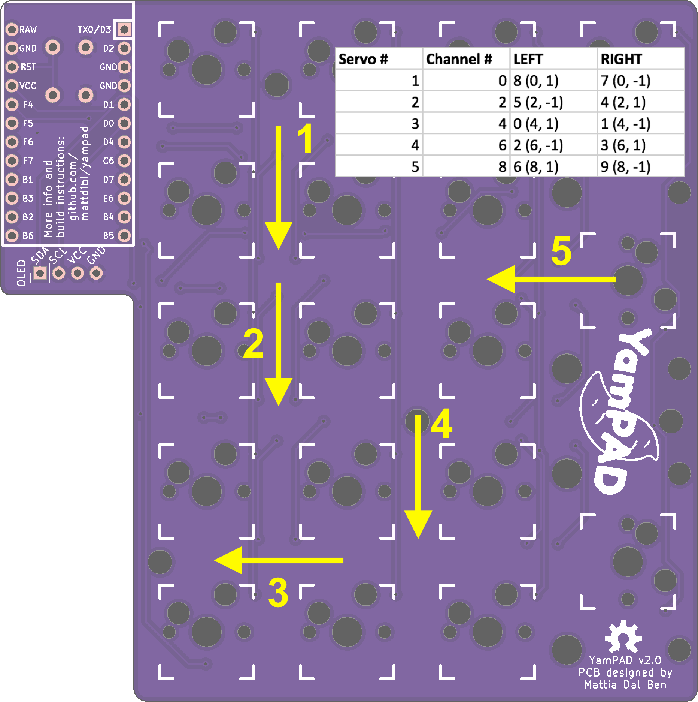
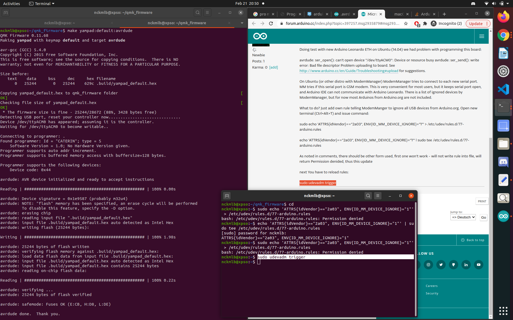
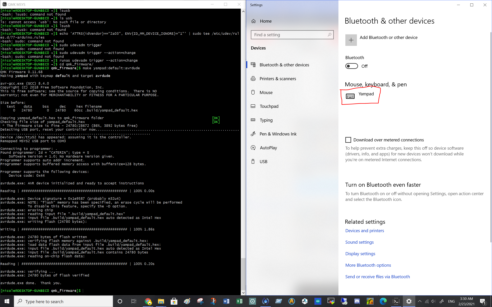
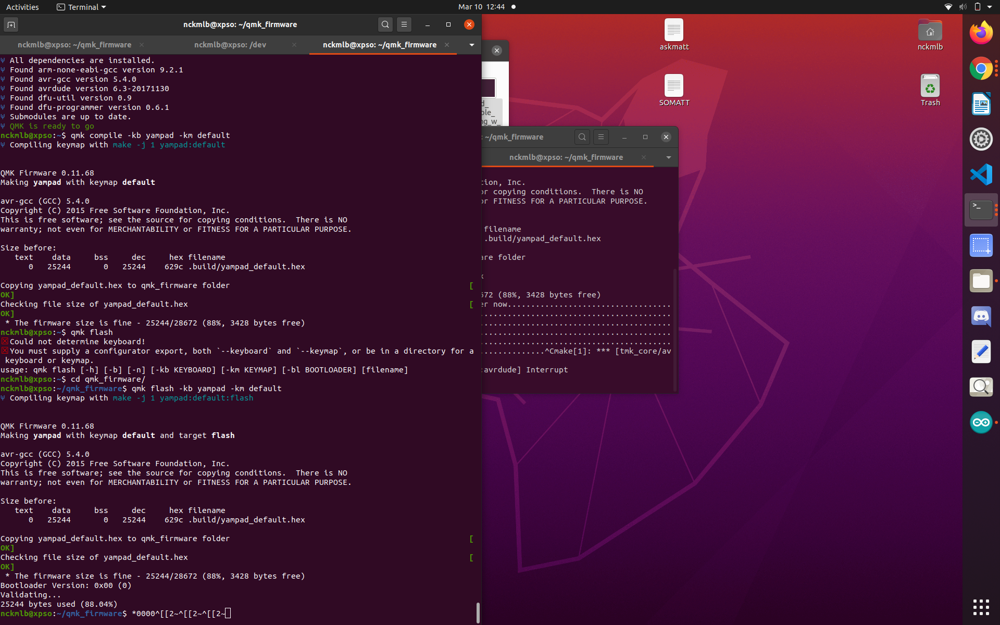
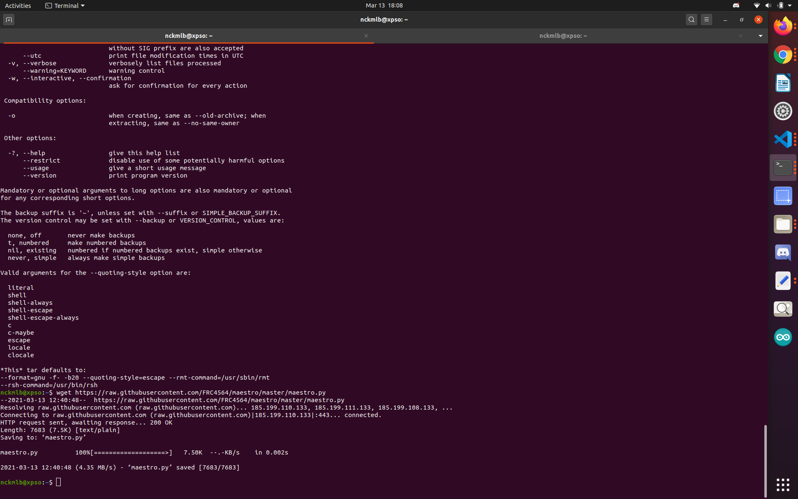
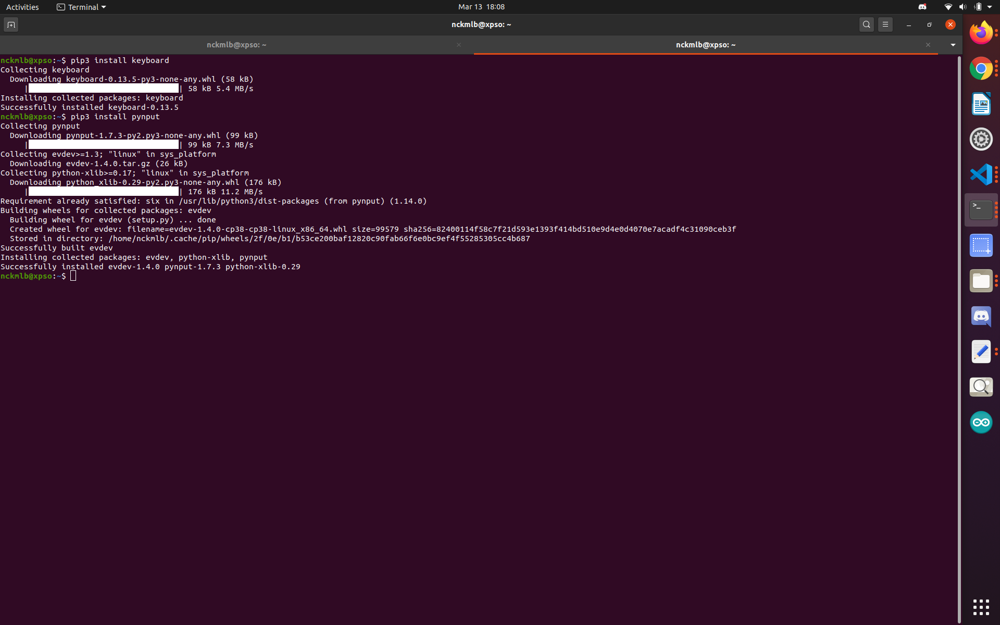

<!-- 

 
Yampad v2

 -->

 

<code align="right">YAMPAD v2
An automated macropad based on the world-famous YamPAD by <a href="https://github.com/mattdibi/yampad" target="_blank" style="margin: auto;">mattdibi</a> </code> 

Inspired by the technology of player pianos, this self-typing keyboard is able to receive and recognize a string of commands, such as a password via loaded text file, and enter it on its own via a series of controlled servo motors while still remaining fully functional as a standard keyboard.

<small>Project completed as MSR Winter Project '21</small>

<h2>Construction:</h2>

<b>Components</b>

    <i>Electronics:</i> 
    • <a href="https://www.pololu.com/product/1352" target="_blank" style="margin: auto;">Mini Maestro 12-Channel USB Servo Controller</a> 
    • <a href="https://www.digikey.com/en/products/detail/adafruit-industries-llc/169/5154651?s=N4IgTCBcDaIM4HMCcYBOACOBTVA3A9iALoC%2BQA" target="_blank" style="margin: auto;">TowerPro RC 5V Servo Motor</a> (x5) 
    • <a href="https://www.sparkfun.com/products/12640" target="_blank" style="margin: auto;">Pro Micro - 5V/16MHz</a> 
    • <a href="https://www.amazon.com/XM-electronic-Display-Communicate-Raspberry/dp/B07RZQ71BD" target="_blank" style="margin: auto;">0.91" OLED Module 128X32 LCD LED Display Module IIC</a> 
    • <a href="https://www.digikey.com/en/products/detail/diodes-incorporated/1N4148W-13-F/2242774?utm_adgroup=Diodes%20-%20Rectifiers%20-%20Single&utm_source=google&utm_medium=cpc&utm_campaign=Shopping_Product_Discrete%20Semiconductor%20Products_NEW&utm_term=&utm_content=Diodes%20-%20Rectifiers%20-%20Single&gclid=EAIaIQobChMI1LT02c3B7gIVhcDACh1yHwvAEAQYAyABEgKn0vD_BwE" target="_blank" style="margin: auto;">1N4148W-13-F Diodes, SMD</a>(18 pcs) 
    • <a href="https://www.mouser.com/ProductDetail/AVX/0805YD104KAT2A?qs=qVfB0%2FDaMDb7XFX9E4jroQ%3D%3D&mgh=1&gclid=EAIaIQobChMI9Jzr49HB7gIVoTizAB2tlQsdEAQYAyABEgJ9sfD_BwE" target="_blank" style="margin: auto;">MLCC SMD/SMT 16V .1uF X5R 0805 10%</a>(9 pcs) 
    • <a href="https://www.amazon.com/LAMPVPATH-Battery-Holder-Bundle-Single/dp/B07BNMKNQX/ref=sr_1_3?dchild=1&keywords=aa+battery+holder&qid=1611134414&sr=8-3" target="_blank" style="margin: auto;">AA Battery Holder</a> 
    • <a href="https://keyhive.xyz/shop/kailh-sockets" target="_blank" style="margin: auto;">MX Kailh Sockets</a>(18 pcs) 
    • <a href="https://github.com/mattdibi/yampad/tree/master/pcb" target="_blank" style="margin: auto;">YamPAD PCB</a> (ordered <a href="https://oshpark.com/" target="_blank" style="margin: auto;">here</a>) 
    • <a href="https://www.pololu.com/product/1352" target="_blank" style="margin: auto;">Mini Maestro 12-Channel USB Servo Controller</a> 
    • <a href="https://www.pololu.com/product/1352" target="_blank" style="margin: auto;">Mini Maestro 12-Channel USB Servo Controller</a> 
    • <a href="https://www.pololu.com/product/1352" target="_blank" style="margin: auto;">Mini Maestro 12-Channel USB Servo Controller</a> 
    • <a href="https://www.pololu.com/product/1352" target="_blank" style="margin: auto;">Mini Maestro 12-Channel USB Servo Controller</a> 
    • <a href="https://www.pololu.com/product/1352" target="_blank" style="margin: auto;">Mini Maestro 12-Channel USB Servo Controller</a> 
    • <a href="https://www.pololu.com/product/1352" target="_blank" style="margin: auto;">Mini Maestro 12-Channel USB Servo Controller</a> 
    • <a href="https://www.pololu.com/product/1352" target="_blank" style="margin: auto;">Mini Maestro 12-Channel USB Servo Controller</a> 
    <i>Hardware:</i> 
    • <a href="https://www.mcmaster.com/acrylic/thickness~3-8/length~12/" target="_blank" style="margin: auto;">12" x 12" x 3/8" Acrylic Sheet</a> 
    • <a href="https://www.mcmaster.com/8774K11/" target="_blank" style="margin: auto;">12" x 12" x 1/8" Acrylic Sheet</a> 
    • <a href="https://www.mcmaster.com/8536K161/" target="_blank" style="margin: auto;">12" x 12" x 1/4" Acrylic Sheet</a> 
    • <a href="https://www.mcmaster.com/90273A159/" target="_blank" style="margin: auto;">6-32 x 2" Phillips Drive Flat Head Machine Screws</a>(x5) 
    • <a href="https://www.mcmaster.com/99961A210/" target="_blank" style="margin: auto;">6-32 Machine Screw Nuts</a> (x15) 
    • <a href="https://www.mcmaster.com/91290A019/" target="_blank" style="margin: auto;">M2-0.4 x 12 mm DIN 912 Hex Drive Class 12.9 Socket Head Screws</a> (x10) 
    • <a href="https://www.mcmaster.com/90591A265/" target="_blank" style="margin: auto;">M2-0.4 DIN 934 Class 8 Hex Nuts</a> (x10) 
    • Binder clips, small (x3) 
    • Mounting tape 
    • Standard sewing thread (the thin stuff) 
    <i>Keys:</i> 
    • <a href="https://www.amazon.com/Cherry-Switches-MX1A-L1NN-Plate-Mounted/dp/B0121JH9XI/ref=sr_1_5?dchild=1&keywords=red+cherry+key+switch&qid=1611119650&sr=8-5" target="_blank" style="margin: auto;">Cherry MX Red Linear Platemounted Keyswitch (10 pack)</a> (x2) 
    • <a href="https://kbdfans.com/collections/keycaps/products/dsa-blank-keycaps-1u-10pcs?variant=34194567364747" target="_blank" style="margin: auto;">KIT21 (purple) DSA Blank Keycaps 1U (10pcs)</a> 
    • <a href="https://kbdfans.com/collections/keycaps/products/dsa-blank-keycaps-1u-10pcs?variant=34194567233675" target="_blank" style="margin: auto;">KIT21 (white) DSA Blank Keycaps 1U (10pcs)</a> 
    <i>Optional:</i>
    • Assorted jumper wires 
    • Sewing kit 
    • Screwdriver set 

 

<b>Assembly</b>

    The different layers of the assembly (please see figure 2) should be cut out first via laser cutter. The thickest piece (the main PCB housing in Figure 2) must be machined a little to create a pocket for the PCB and its surface mounted components according to the drawing that can be found <a href="https://github.com/nbaptist16/YAMPad_v2/src/yamboi.pdf" target="_blank" style="margin: auto;">here</a>. Also be sure to cut out a little space for the usb to fit, as seen in the drawing, with the band saw. File down the edges as needed. Once that's done, you can <a href="https://github.com/mattdibi/yampad#assembly-details" target="_blank" style="margin: auto;">solder</a> up the PCB with all of its components (diodes, capacitors, pro micro, reset button, and LCD) and pop it into the main PCB housing.

    Perhaps the trickiest part of this entire project is the threading of the keys. Using a needle and needle threader helps significantly here, but it is also possible to thread everything without such tools. (Fold a portion at the end of the tread and twist it a bit to the point that it fits through the key switch/servo horn holes.)
      
    The thread should be divided up into N pieces, each 9" long, where N is the number of keys that with auto-type capabilities. The desired N key switches are disassembled (most easily with the use of a flathead screwdriver (as seen in the demo video), but this can also be done without a screwdriver) and threaded. Once the desired keys are threaded, the ends of each string are threaded through the corresponding holes in the pcb (as seen in the example below).  

 

<small>Figure 1. Strings (black) threaded through preipheral holes while center of switch (yellow) and leads fit through remaining holes; PCB image generated by OSH Park </small>
 

Once the thread ends are through their respective holes in the PCB, they are threaded through the bottom plate (please see Figure 2) and the designated servo horn (please see Figure 3).

    
     

<small>
    Left: Figure 2. Layer guide for assembly
    &emsp;
    Right: Figure 3. Servo layout guide* 
    
* Note: The arrows are pointing in the direction that the horn faces outward radially from the motor. More servos can be added and rearranged if the user desires for more automated key capabilities

</small>

    Once the key switches, top and bottom plate, and main housing are all relatively together, the servo motors can be fitted into the servo mount layer and screwed in with the M2s. Fit the servo horns on the respective motors and screw them on tight before combining all layers together with the 6-32 screws and nuts. Be careful to keep the strings together and threaded through the servo horns! 
    Finally, tape and clip those strings down so that they are taut, but not noticably pulling down any keys. 

<small>Note: please see the title picture for an example of a finished result.</small>

<b>Keyboard Flashing</b>

    For <code>LINUX</code>, the flashing portion of the keyboard can be done through the following steps:

    Set up a QMK environment on your computer by following the steps listed <a href="https://docs.qmk.fm/#/newbs_getting_started" target="_blank" style="margin: auto;">here</a>.

    Clone the yampad repository in a new workspace using the command <code>git clone https://github.com/mattdibi/qmk_firmware</code>.

    Change your directory to the <code>qmk_firmware</code> directory with the command <code>cd qmk_firmware</code>. When inside, checkout the yampad branch with <code>git checkout yampad</code>.

    Copy the <code>./keyboards/yampad</code> directory into the <code>~/qmk_firmware/keyboards</code> directory with the command <code>cp ./keyboards/yampad ~/qmk_firmware/keyboards</code>.

    Change directory back to the the <code>qmk_firmware</code> directory with the command <code>cd ~/qmk_firmware</code>.

    Run the following commands: 
    <code>qmk compile -kb yampad -km default</code>
    <code>make yampad:default:avrdude</code>

    It will likely ask you to "reset your controller now...". If you were able to properly solder on the reset button, press that. If you're like me and forgot to solder on the button, no worries. It should work as long as you touch the RST to the adjacent GND pin. (But be careful not to touch any other pins! That poses the danger of shorting something.) The output should look like this:  

    

    This process can also be done on Windows and Mac. They should all be about the same, as seen in the windows screenshot attached below:

    

<small>Note: to flash the keyboard on windows, you will need to install QMK MSYS, which you use to run the terminal commands.</small>

    If you are having trouble finding the port, it could be that you shorted something when trying to reset the controller. If you can find the port, but are having trouble using the above mentioned commands (<code>qmk compile -kb yampad -km default</code> and <code>make yampad:default:avrdude</code>), consider running: 
    (<code>qmk compile -kb yampad -km default</code> )
    (<code>qmk flash</code> )
    <code>cd qmk_firmware</code> 
    <code>qmk flash -kb yampad -km default</code> 

    

<b>Automation</b>

    The python scripts provided require the maestro.py file to be in the same directory as the file being run. The easiest way to run the program is likely through a text editor such as VS Code. A few additional installations are required. The commands and outputs are shown in the image below.

     
     

    To run the text reading script (reads in a .txt all numbers from 0 to 9), use the maepy_read.py script and enter the filename to include the path (as seen in the demo) 
    To run the key input reading script, follow the same steps as with maepy_read.py, but substitute maepy_type.py. 
    You can recalibrate the servos if they get too twitchy with any of the init files. (If they are too twitchy, try increasing the voltage input to the maestro. I typically use 6V).

